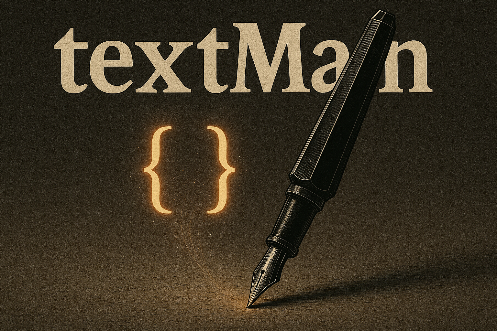

<p align="center">
  
</p>

# textMan: Advanced Text Manipulation Tool

> **textMan** bridges the gap between simple editors and complex IDEs, empowering everyone—from casual tweakers to power users—to wield text transformations with ease and intelligence.

## 📋 Table of Contents

- [🎯 Vision & Philosophy](#-vision--philosophy)  
- [✨ Key Features](#-key-features)  
- [🏗️ Architecture](#️-architecture)  
- [⚙️ Installation](#️-installation)  
- [🚀 Quick Start](#-quick-start)  
- [🔌 Plugin System](#-plugin-system)  
- [🛣️ Roadmap](#️-roadmap)  
- [👥 Contributing](#-contributing)  
- [🌐 Community](#-community)  
- [📄 License](#-license)  

## 🎯 Vision & Philosophy

> ### Core Philosophy
> 
> - 🔌 **Extensibility First**: Plugin‑based for limitless growth
> - 🖥️ **Interface Flexibility**: Terminal • Web • Desktop
> - ⚖️ **Progressive Complexity**: Easy for basics, powerful for pros
> - 🧠 **Text Intelligence**: Context‑aware, structure‑savvy processing

textMan aims to be a comprehensive, extensible text manipulation tool that empowers users to efficiently process, analyze, and transform text through multiple interfaces. Whether you're cleaning data, formatting code, or analyzing documents, textMan provides both simple commands for basic tasks and advanced functionality for complex operations.

## ✨ Key Features

- 📝 **Basic Ops**: case conversion, sorting, formatting, smart find/replace  
- 🔍 **Advanced Patterns**: regex wizardry, multi‑step search & replace  
- 📊 **Text Analysis**: readability scores, keyword extraction, sentiment insights  
- 💻 **Code Processing**: syntax highlighting, auto‑format, minify  
- 🗃️ **Data Tools**: parse CSV/JSON/XML from plain text  
- 🔄 **Document Diff**: side‑by‑side diffs, merge assistants  
- 🔄 **Format Conversion**: Markdown ↔ HTML ↔ LaTeX  
- 🏷️ **Domain Plugins**: customize NLP, legal‑doc helpers, scientific text  

## 🏗️ Architecture

<p align="center">
  
</p>

<details>
  <summary><strong>Layer Breakdown</strong></summary>

```
User Interfaces
 ├─ Terminal
 ├─ Web
 └─ Desktop
     │
Core Engine
 ├─ Text Manager
 ├─ State Manager (undo/redo)
 └─ Configuration
     │
Plugin System
 ├─ Text
 ├─ Regex
 ├─ NLP
 ├─ Code
 └─ Data
```
</details>

## ⚙️ Installation

<details>
  <summary><strong>Requirements</strong></summary>

- Python **3.8+**  
- Dependencies managed through requirements.txt:
  - click: Command line interface creation
  - rich: Terminal formatting and display
  - regex: Enhanced regular expression support
  - pydantic: Data validation and settings management
  - (Additional packages for specific plugins)
</details>

```bash
# Clone the repository
git clone https://github.com/yourusername/textMan.git
cd textMan

# Create & activate virtual environment
python -m venv venv
source venv/bin/activate  # On Windows: venv\Scripts\activate

# Install dependencies
pip install -r requirements.txt

# Install development version (editable)
pip install -e .
```

## 🚀 Quick Start

1. **Launch Terminal UI**  

   ```bash
   textman --help
   ```

2. **Basic Text Processing**  

   ```bash
   # Case conversion
   echo "Hello World" | textman uppercase
   # Output: HELLO WORLD
   
   # Sort lines alphabetically
   cat myfile.txt | textman sort > sorted.txt
   
   # Remove duplicate lines
   textman --file input.txt --output unique.txt unique
   ```

3. **Advanced Regex**  

   ```bash
   # Replace all numbers with [NUM]
   textman regex --pattern "\d+" --replace "[NUM]" --input report.txt
   
   # Extract all email addresses
   textman regex --extract "[A-Za-z0-9._%+-]+@[A-Za-z0-9.-]+\.[A-Za-z]{2,}" --input contacts.txt
   ```

4. **Working with Files**

   ```bash
   # Load, transform, and save
   textman --file document.txt --output result.txt capitalize
   
   # Chain multiple operations
   textman --file data.txt trim unique sort
   ```

> 💡 **Tip:** Use `textman --list-plugins` to discover all installed plugins and their capabilities.

## 🔌 Plugin System

- **Discover plugins**: `textman plugin list`  
- **Install from PyPI**: `pip install textman-plugin-<name>`  
- **Create your own plugin**:  

  ```bash
  textman plugin scaffold myplugin
  cd myplugin
  ```

<details>
  <summary><strong>Plugin API Example</strong></summary>

```python
from textman.plugins import Plugin

class MyTransform(Plugin):
    """Custom text transformation plugin."""
    
    name = "my-transform"
    version = "1.0.0"
    description = "Transforms text in a specific way"
    category = "text"  # Options: text, regex, nlp, code, data, utility
    
    def process(self, text: str, option1: str = "default", option2: bool = False) -> str:
        """Transform the input text.
        
        Args:
            text: The input text to transform
            option1: First configuration option
            option2: Second configuration option
            
        Returns:
            The transformed text
        """
        # Implement your text transformation logic
        result = text
        if option2:
            result = result.upper()
        
        return f"{option1}: {result}"
```
</details>

Plugin categories include:
- **Text**: Basic text transformations
- **Regex**: Regular expression operations
- **NLP**: Natural language processing
- **Code**: Programming language specific tools
- **Data**: Structured data extraction and formatting
- **Utility**: Miscellaneous tools

## 🛣️ Roadmap

<details>
  <summary><strong>Phase 1: Foundation (✅ In Progress)</strong></summary>

- [x] Create project structure
- [x] Implement core engine with basic text operations
- [x] Design plugin architecture
- [x] Develop state management (undo/redo)
- [ ] Build command-line interface
- [ ] Implement basic plugins:
  - [ ] Text operations (case conversion, sorting)
  - [ ] Regular expression tools
  - [ ] Basic formatting features
</details>

<details>
  <summary><strong>Phase 2: Core Capabilities</strong></summary>

- [ ] Text analysis capabilities:
  - [ ] Word/character counting and statistics
  - [ ] Readability metrics
  - [ ] Basic keyword extraction
- [ ] Multi-file handling:
  - [ ] Batch operations
  - [ ] Auto-save functionality
  - [ ] Session restoration
- [ ] Diff and comparison tools:
  - [ ] Text difference highlighting
  - [ ] Merge capabilities
  - [ ] Version comparison
</details>

<details>
  <summary><strong>Phase 3: Advanced Features</strong></summary>

- [ ] Web interface:
  - [ ] RESTful API
  - [ ] Interactive browser UI
  - [ ] Real-time collaboration
- [ ] Advanced processing:
  - [ ] NLP capabilities (tokenization, named entity recognition)
  - [ ] Sentiment analysis
  - [ ] Text summarization
- [ ] Code-specific features:
  - [ ] Syntax highlighting for multiple languages
  - [ ] Code formatting
  - [ ] Linting integration
- [ ] Data extraction tools:
  - [ ] Tabular data parsing
  - [ ] Extract structured information (emails, URLs, dates)
  - [ ] Convert between data formats
</details>

<details>
  <summary><strong>Phase 4: Expansion & Integration</strong></summary>

- [ ] Desktop GUI application
- [ ] Integration capabilities:
  - [ ] API hooks for external applications
  - [ ] Cloud storage support
  - [ ] Version control integration
- [ ] Document features:
  - [ ] Template system
  - [ ] Markdown processing
  - [ ] Document generation
- [ ] Localization support:
  - [ ] Multi-language interfaces
  - [ ] Translation assistance
  - [ ] Locale-specific text processing
</details>

See our [Project Board](https://github.com/yourusername/textMan/projects) for detailed development status.

## 👥 Contributing

> **We ❤️ contributions!** Please read [CONTRIBUTING.md](CONTRIBUTING.md) for guidelines.

1. **Fork & Branch**  
   Fork the repository and create a feature branch  
   ```bash
   git checkout -b feature/your-feature-name
   ```

2. **Develop & Test**  
   Write your code and include tests  
   ```bash
   # Run tests
   pytest
   
   # Check code style
   black .
   flake8
   ```

3. **Submit PR**  
   Push your changes and create a pull request  
   ```bash
   git push origin feature/your-feature-name
   ```

4. **Review Process**  
   Wait for code review and address any feedback

## 🌐 Community

- [**GitHub Discussions**](https://github.com/yourusername/textMan/discussions) - Ask questions and share ideas
- [**Discord**](https://discord.gg/textman) - Join our community chat
- [**Twitter**](https://twitter.com/textmanproject) - Follow for updates
- [**Documentation**](https://textman.readthedocs.io/) - Comprehensive guides and API reference

We welcome contributions of all kinds - whether you're fixing bugs, improving documentation, or suggesting new features, your input is valuable!

## 📄 License

Released under the **MIT License**. See [LICENSE](LICENSE) for details.

<p align="center">
  Made with 💡 and 🔤 by the textMan Team  
</p>
